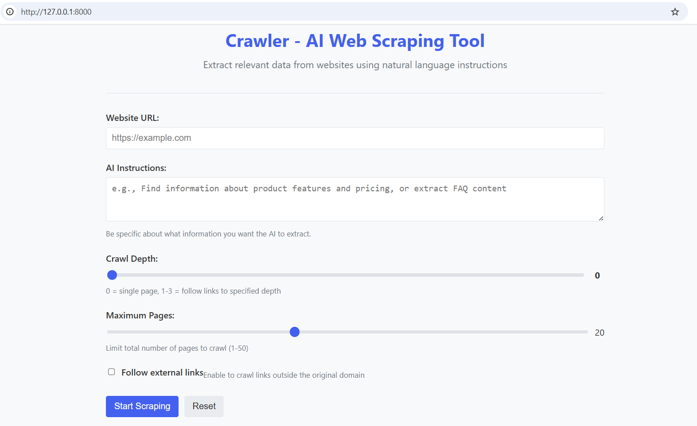
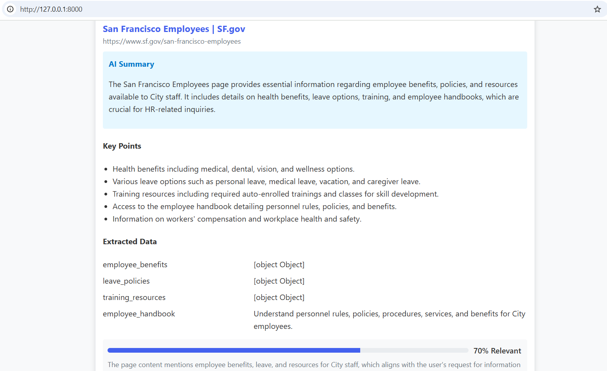

# Crawler - AI Web Scraping Tool for RAG Systems



Crawler is an intelligent web scraping tool that uses AI to extract relevant content from websites based on natural language instructions. It's designed specifically for creating high-quality documents for Retrieval Augmented Generation (RAG) systems.

## Features

- **Natural Language Instructions**: Tell the crawler what information you want in plain English
- **Intelligent Content Extraction**: Uses AI to identify and extract only the most relevant content
- **Smart Link Following**: Crawls through websites, following links to find related content
- **Dynamic Content Handling**: Waits for JavaScript-rendered content to load
- **RAG-Ready Document Creation**: Outputs structured, chunked documents optimized for RAG systems
- **Error Handling**: Robust handling of rate limiting, network errors, and other issues

## Installation

```bash
# Clone the repository
git clone https://github.com/yourusername/crawler.git
cd crawler

# Install dependencies
python install_dependencies.py

# Set up your environment variables (create a .env file)
echo "OPENAI_API_KEY=your_api_key_here" > .env
```

## Basic Usage

```python
import os
from crawler import CrawlerClient

# Get API key from environment variable
key = os.getenv('OPENAI_API_KEY')

# Initialize the client
client = CrawlerClient(api_key=key)

# Define your instructions
instructions = "We're building a chatbot for HR. Extract information about employee benefits and company policies."

# Scrape a website
documents = client.scrape("https://example.com", instructions)

# Process for RAG
rag_documents = client.create_rag_documents(documents)

# Print the first document
print(f"Document Type: {rag_documents[0]['chunk_type']}")
print(f"Content: {rag_documents[0]['content'][:100]}...")
print(f"Metadata: {rag_documents[0]['metadata']}")
```

## Web Interface

Crawler includes a user-friendly web interface that allows you to:
- Enter a website URL and natural language instructions
- Configure crawl depth and other parameters
- Run the crawler and view results in real-time
- Download extracted data in JSON or Markdown format

### Running the Web Interface

```bash
# From the project root directory
cd crawler
python -m api.main

# Or for development mode with auto-reload
DEBUG=True python -m api.main
```

By default, the web interface will be available at http://localhost:8000




## How It Works

Crawler operates through several key components working together:

1. **EnhancedCrawlerClient**: The main entry point that handles the crawling process
2. **AiProcessor**: Uses OpenAI models to extract relevant content based on instructions
3. **AsyncWebCrawler**: Manages browser automation for handling JavaScript-rendered content
4. **Web Interface**: Provides a user-friendly way to interact with the crawler

The process flow is:

1. User provides a URL and natural language instructions
2. Crawler visits the specified URL and extracts content
3. AI analyzes the content for relevance to the instructions
4. If depth > 0, crawler follows links and repeats the process
5. Content is processed into chunks optimized for RAG systems
6. Results are returned in a structured format

## Advanced Usage

### Controlling Crawl Depth

You can control how deep the crawler follows links:

```python
# Only crawl the specified URL (depth=0)
documents = client.scrape("https://example.com", instructions, depth=0)

# Follow links 2 levels deep
documents = client.scrape("https://example.com", instructions, depth=2)
```

### Following External Links

By default, the crawler only follows links within the same domain:

```python
# Enable following links to external domains
documents = client.scrape("https://example.com", instructions, follow_external_links=True)
```

### Limiting Pages

Control the maximum number of pages to crawl:

```python
# Limit to 10 pages maximum
documents = client.scrape("https://example.com", instructions, max_pages=10)
```

### Exporting Results

Export results to markdown for easy viewing:

```python
# Export to Markdown
client.export_to_markdown(documents, "results.md")
```

## RAG Integration

The `create_rag_documents()` method returns documents structured for RAG systems:

```python
rag_documents = client.create_rag_documents(documents)
```

Each document includes:
- `chunk_type`: "summary", "key_point", or "content"
- `content`: The actual text content
- `metadata`: Source URL, title, relevance score, and more

### Integrating with Vector Databases

Here's how to integrate with popular vector databases:

#### Chroma

```python
import chromadb
from crawler import CrawlerClient

# Initialize clients
crawler_client = CrawlerClient()
chroma_client = chromadb.Client()
collection = chroma_client.create_collection("my_rag_collection")

# Crawl website
documents = crawler_client.scrape("https://example.com", "Extract product information")
rag_documents = crawler_client.create_rag_documents(documents)

# Add documents to Chroma
for i, doc in enumerate(rag_documents):
    collection.add(
        ids=[f"doc_{i}"],
        documents=[doc['content']],
        metadatas=[doc['metadata']]
    )
```

#### LangChain

```python
from langchain.vectorstores import FAISS
from langchain.embeddings import OpenAIEmbeddings
from crawler import CrawlerClient

# Initialize clients
crawler_client = CrawlerClient()
embeddings = OpenAIEmbeddings()

# Crawl website
documents = crawler_client.scrape("https://example.com", "Extract product information")
rag_documents = crawler_client.create_rag_documents(documents)

# Prepare documents for LangChain
texts = [doc['content'] for doc in rag_documents]
metadatas = [doc['metadata'] for doc in rag_documents]

# Create vector store
vector_store = FAISS.from_texts(texts, embeddings, metadatas=metadatas)

# Search
query = "What are the product features?"
results = vector_store.similarity_search(query)
```

## Requirements

- Python 3.9+
- OpenAI API key (for AI content processing)
- Playwright (for browser automation)

## License

MIT